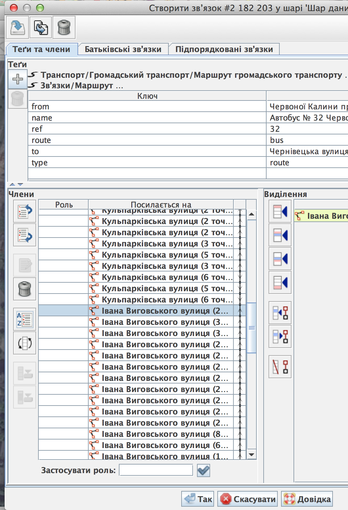
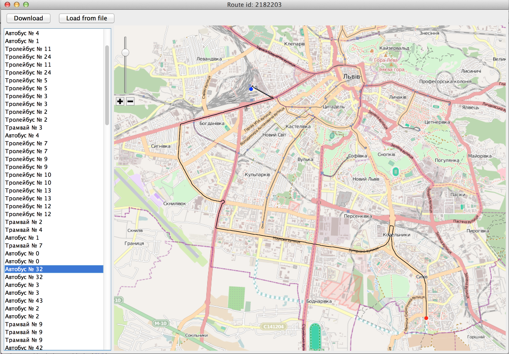

<h1>Помилки при редагуванні маршрутів</h1>
<h2>Порядок доріг для маршрутів</h2>

Помилку з порядком можна легко визначити глянувши програму для прегляду маршрутів. Наприклад маршрут №32 - червоним позначено початок маршруту, синів - кінець. Як бачимо кінець маршруту розташований не на своєму місці.

</img>

Завантажуємо звязок(relation) в Josm (id маршруту прописане в шапці форми)

</img> 

Після завантаження глянемо на звязок і їх елементи. Можна одразу побачити що не усі вулиці звязані одне з одним (стовпчик справа від імен вулиць):

</img> 

для того міняємо їх порядок так щоб утворилась суцільна лінія

</img> 

відправляємо зміни на сервер і нажимаємо 'download' щоб оновити дані, і знову дивимось на маршрут. Ну от, тепер усе на своїх місцях.

</img> 
